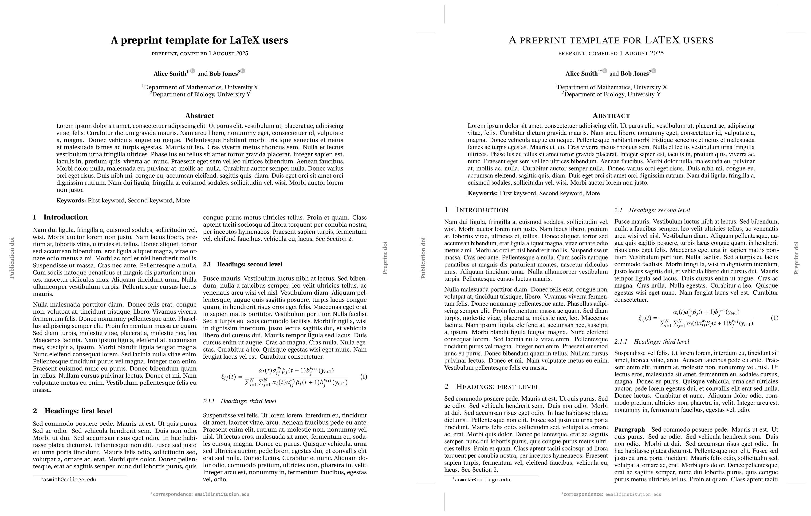

# Preprint+ – A generic LaTeX template

A clean, general purpose preprint template that doesn’t get in the way.

This was forked from the [`preprint-template.tex`](https://github.com/brenhinkeller/preprint-template.tex/blob/master/preprint.sty) (itself a fork of the [`arxiv-style`](https://github.com/kourgeorge/arxiv-style) template) and extended to better support manuscripts that will be submitted to journals. This lead to the following user-facing changes:

- A rich collection of option flags making every feature optional.
  This allows authors to turn off features that may clash with the journal’s template.
- Additional options to set fonts, title style and page dimensions.
  + This is not an all-you-can eat template.
    The idea is to provide a few useful sets of configurations,
    so that authors are not locked in to using Times New Roman.
- A revised interface for specifying abstract and keywords in the preamble, and have them typeset as part of `\maketitle`. This is more in line with how one would prepare a manuscript using e.g. Springer-Nature’s or PNAS’ templates.
- Added a `\supplementary` command for typesetting Supplementary material as part of the PDF. This allows cross-references between the main text and supplementary, while still making it easy to submit the latter to the journal as a separate file.
  This is distinct from the `\appendix`, which is usually typeset as part of the text, just after references.

Under the hood, the style file has been completely rewritten in LaTeX3 syntax, which is how we are able to provide all of these options without it becoming an unmaintainable mess.
In fact, the organization into separate files makes it _easier_ to maintain, despite the variety of options.
For example, font options are easily added to `preprint+fonts.sty` by emulating one of the code blocks already there, and then adding a corresponding option under `font .choice:` in `preprint.sty`.



To get almost identical output to the original `preprint-template.tex`, use the following to import the package:

```latex
\documentclass[twocolumn]{article}
\usepackage[font=times,
            status=preprint,
            geom=twocolumn,
            floatplacement=medium,
            headingstyle=smallcaps,
            marginticks
            ]{preprint+}
```

this will produce the output on the left.

In contrast, if you just `\usepackage{preprint+}` with default options, this will produce the output on the right and is equivalent to

```latex
\documentclass[twocolumn]{article}
\usepackage[font=erewhon,
            geom=twocolumn,
            floatplacement=tight,
            suppfloatplacement=extratight,
            headingstyle=bold,
            ]{preprint+}
```

## Package options

| Option     | Value     | Description |
|------------|-----------|-------------|
| __geom__   | twocolumn | Page dimensions of `preprint-template.tex`, designed for two column output. Default option for `\documentclass[twocolumn]`. |
|            | onecolum  | Page dimensions of the `arxiv-style`, designed for one column output. Default option for `\documentclass[onecolumn]`. |
|            | natcomm   | A text area approximating that of the Nature Communications layout. A good choice if you want minimal margins. |
|            | none      | Don’t set the page size; don’t even load the `geometry` package. |
| __headingstyle__| bold | Use bold face to demarcate headings. (default) |
|            | smallcaps | Use small caps to demarcate headings. |
|            | none      | Don’t style headings; let the class do so according to its defaluts. |
| __status__ | \<str\>   | Arbitrary string, akin to a subtitle. Will also be printed in the running header. Typical values are "Preprint", "Under review", "Published in ___" |
| __supplementarytitle__   | \<str\> | Arbitrary string. Printed below the article title at the start of the supplementary. Default: "Supplementary Information". |
| __supplementaryprefix__  | \<str\> | Arbitrary string which is printed before "figure" or "table" for floats in the supplementary. Default: "Supplementary". |
| __floatplacement__<br>/__suppfloatplacement__       | loose | Close to the default float placement values for the `article` class (although still a bit more permissive). Makes it difficult to place text alongside floats, so they are more likely to be placed by themselves on a float page. |
|  | medium | More permissive; floats are less likely to be placed on their own page. |
|                          | tight | Still more permissive; default for `floatplacement`, which is the setting for the main text and appendix. |
|                          | extratight | Allows to place figures alongside text, even if there is very little text. Default for `suppfloatplacement`, which is the setting for the supplementary. |
| font   | erewhon  | (default) A modern font which looks very similar to times but with simpler shapes, resulting in overall lighter text. This is a full font set, using the recommended combination of `erewhon` (roman), `cabin` (sans), `inconsolata` (typewriter) and `utopia` (math). |
|        | times    | A Times New Roman font used by both `preprint-template.tex` and `arxiv-style`. Will use `txfonts` if available, providing consistent math fonts. Note that these math fonts are horizontally much more compact than others, which can affect how well equations fit into the column. |
|        | cm       | Does not load any fonts, and so uses the Computer Modern defaults. Just sets `fontenc` and loads `amssymb` for consistency with other font options. |
|        | venturis | This is the closest available TeX font I found to Nature’s sans-serif, although my search was far from exhaustive. Note that this is an incomplete font set: roman & math fonts are left unchanged. |
|        | none     | Don’t do anything with regards to fonts, not even setting the `fontenc`. |
| marginticks | N/A | If option `marginticks` is given, will print tick marks indicating the margins. Currently only works with `geom=twocolumn` because the dimensions are hard-coded. The default is not to print margin ticks. |


### Deactivation flags

| Option   | Value     | Description |
|----------|-----------|-------------|
| __orcid__| true      | Provide an `\orcid` macro for creating ORCiD icons in affiliations. Will load `tikz` |
|          | false     | Don’t provide the macro.
| __fancyhdr__ | true  | The `fancyhdr` package is used to produce the header & footer on each page. |
|              | false | `fancyhdr` is not loaded and header & footer are styled according to class defaults. |
| __titlesec__ | true  | The `titlesec` package is used to style the section headers, as well as the title of the Supplementary Information (which is styled as a "part"). |
|              | false | `titlesec` is not loaded. Section and part titles keep their class defaults. |

### Other features:

- `\usepackage{microtype}` is loaded by default. To turn it off, use `\documentclass[draft]`
- In the Supplementary, where the figure/text ratio tends to be higher, figures are given the `[h]` option by default to encourage them not to float too far.


## Usage

__Simple usage__: Download `preprint+_singlefile.sty` into the directory containing your TeX source, and rename it to `preprint+.sty`.[^GHA] Then `\usepackage{preprint+}` as usual.

__Advanced usage__: If you wish to modify the source, you should clone the directory. This way you benefit for the organization into separate files for making your modifications. Just make sure to clone somewhere in your TeX path, and you will be able to `\usepackage{preprint+}`.


[^GHA]: Eventually I may have the combined file automatically produced with a GitHub Action, but for now renaming is the way to go.